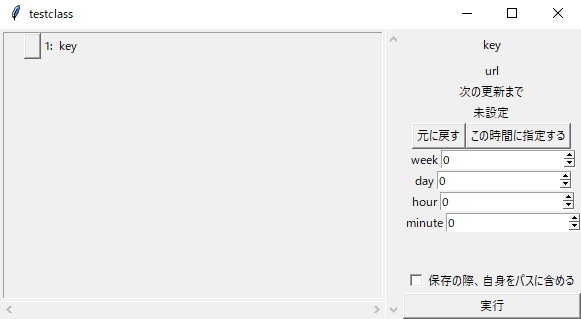

# Classroom Hack
This application's objective is downloading files from google classroom to local machine. 
Here is a way to use this app manual.

## How to use
 
This is a gui of this app. You pay attention side window. It shows a lesson sections like the tree view.
If you press a button which on the left of key, its expand and you can see the sub sections. 

Each section has its own URL. When you press the button in the lower right corner of the window, the internal web driver accesses that URL and retrieves the URL and key for the next section. It displays it in the side window. 
In google classroom, files can only be downloaded by accessing the URL. So if the url you access is a file, it will be downloaded to your local machine. 

### Periodic execution
You can set a periodic execution. You can set a interval in a right side's week, day, hour, minute spin boxes.

  

# 日本語での説明
このアプリの目的は、google classroomからローカルマシンにファイルをダウンロードすることです。
これからこのアプリの使い方を説明します。

## 使い方
 
これはこのアプリのGUIです。サイドウィンドウに注目。ツリービューのように授業の項目が表示されます。
キーの左にあるボタンを押すと、サブ項目がその下に展開されます。

各セクションはそれぞれのURLを持っています。ウィンドウの右下にあるボタンを押すと、内部のウェブドライバーがそのURLにアクセスし、次のセクションのURLとキーを取得します。それをサイドウィンドウに表示します。
google classroomでは、ファイルはURLにアクセスすることによってのみダウンロードできます。そのためもしアクセスするurlがファイルであれば、ローカルマシンにダウンロードされます。 

## 定期実行
定期的な実行を設定できます。右側の週、日、時、分のスピンボックスでインターバルを設定できます。